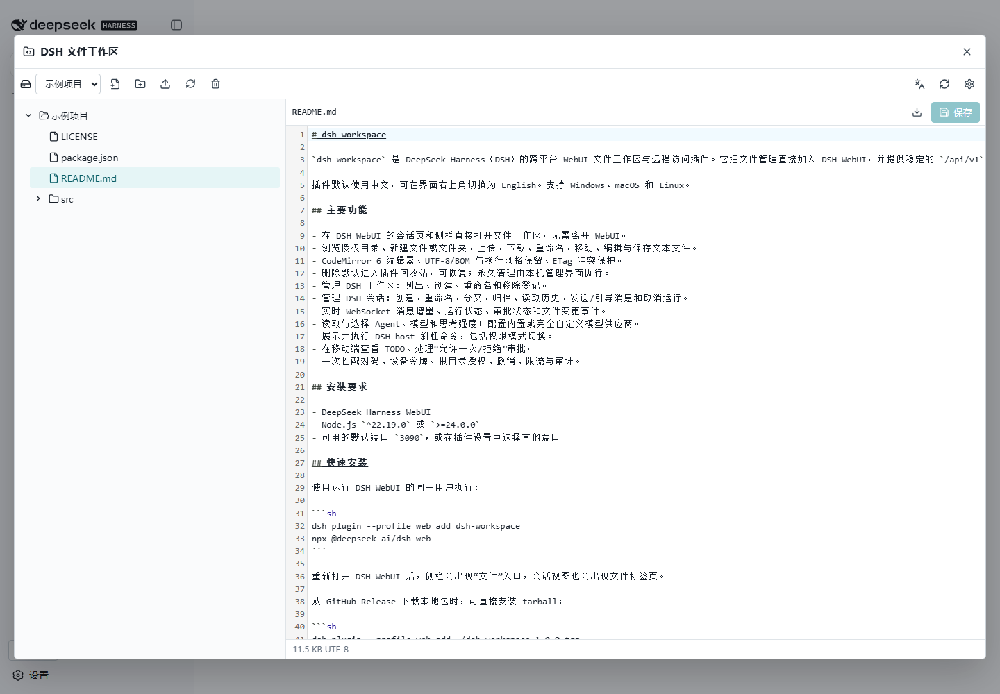
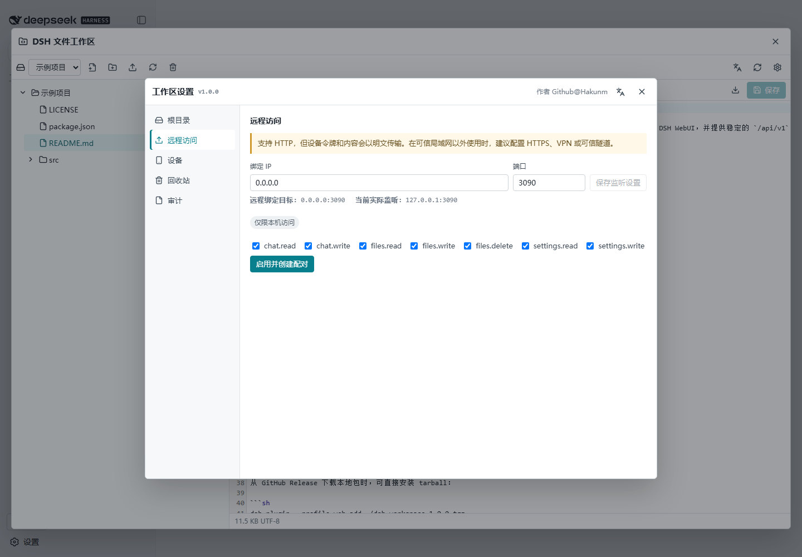

# dsh-workspace

<p align="center">
  <strong>A file workspace inside DeepSeek Harness WebUI, plus a stable remote API for mobile and third-party clients.</strong>
</p>

<p align="center">
  <a href="./README.md">中文</a> · English
</p>

<p align="center">
  
  
  
  
</p>

`dsh-workspace` adds a practical file workspace directly to DeepSeek Harness (DSH) WebUI. It also exposes a versioned API used by [dsh-android-app](https://github.com/Hakunm/dsh-android-app) and other trusted clients for chat, workspace, file, model, command, and approval workflows.

The interface is bilingual and defaults to Chinese. Prebuilt packages run on Windows, macOS, and Linux without compiling on the target server.

## Screenshots

Browse and edit files without leaving DSH WebUI.



Remote access remains disabled until a local administrator chooses a bind address, port, and initial device permissions.



## Quick install

### Requirements

- A working DeepSeek Harness WebUI installation
- Node.js `^22.19.0` or `>=24.0.0`
- Port `3090`, or another available port

Run as the same operating-system user that runs DSH WebUI:

```sh
dsh plugin --profile web add https://github.com/Hakunm/dsh-workspace/releases/download/v1.0.0/dsh-workspace-1.0.0.tgz
npx @deepseek-ai/dsh web
```

Restart WebUI after installation. A **Files** entry appears in the sidebar, and conversations gain a file tab.

To install a downloaded release archive:

```sh
dsh plugin --profile web add ./dsh-workspace-1.0.0.tgz
```

## First connection

1. Open **Files** in DSH WebUI and select **Workspace settings**.
2. Add a local directory under **Roots** and give it a recognizable label.
3. Return to the workspace and select that root to browse or edit files.
4. For mobile access, open **Remote access**, enter the bind IP and port, and save them.
5. Select **Enable and create pairing**, then enter the ten-minute one-time code in the app.

Remote access cannot be enabled before at least one root exists. Installing the plugin does not expose it to the LAN; it listens on loopback until a local administrator enables remote access.

## Features

### WebUI file workspace

- Lazy directory browsing and file/folder creation.
- Upload, download, replace, rename, and move.
- CodeMirror 6 editing for UTF-8 text.
- Best-effort preservation of UTF-8 BOM and original line endings.
- ETag conflict detection that refuses silent overwrites.
- Plugin-managed trash and restore; permanent purge stays local-only.
- Metadata, download, and replacement for binary files without treating them as text.

### Stable client API

The public API is independent of DSH private wire protocols. Authorized clients can:

- list, register, rename, and remove DSH workspace registrations;
- create, rename, fork, and archive sessions;
- read history, stream text and reasoning, steer messages, and cancel runs;
- display TODOs, slash commands, permission modes, and approval requests;
- select Agents, models, and reasoning effort;
- inspect or update built-in and fully custom model providers;
- manage files and trash within explicitly granted roots.

## Remote access and security

The default remote target is `0.0.0.0:3090`; both values are configurable. Clients may connect through any reachable IP address or domain name.

HTTP is supported and TLS is not mandatory. That keeps trusted-LAN and temporary deployments simple, but plain HTTP sends device tokens, chat, and file content in clear text. Use HTTPS through Caddy/Nginx, a VPN, Tailscale/WireGuard, or a trusted tunnel on public or untrusted networks.

The following controls remain active over both HTTP and HTTPS:

- ten-minute, single-use pairing codes;
- 256-bit device tokens stored server-side only as digests;
- revocable scopes and per-root grants;
- separate rate limits for pairing, authentication failures, and normal requests;
- audit records that omit tokens, file bodies, and chat bodies;
- no automatic access to roots added after a device was paired.

Only a loopback client may add roots, change device grants, create pairing codes, configure the listener, or permanently purge trash.

## Path boundary

External requests use `rootId + relativePath`, never an absolute server path.

- Wire paths use `/`.
- Absolute paths, drive letters, UNC paths, backslashes, null bytes, and `.` or `..` segments are rejected.
- Every operation checks path segments for symlinks, junctions, and reparse points.
- Deleting a final link removes the link itself without traversing its target.
- Save temp files are placed beside the destination to avoid cross-device replacement failures.

Removing a DSH workspace removes only its WebUI registration. Directories, files, and session logs remain. Archiving a session hides it from the default list while preserving its log.

## Public API

REST base URL:

```text
http://HOST:PORT/api/v1
```

Every request except health and pairing exchange uses:

```http
Authorization: Bearer DEVICE_TOKEN
```

| Endpoint | Purpose |
| --- | --- |
| `GET /healthz` | Service, API, and plugin version |
| `POST /pairings/exchange` | Exchange a one-time code for a device token |
| `GET /devices/self` | Current device, scopes, and root grants |
| `GET /roots` | Granted file roots |
| `GET/POST/PATCH/DELETE /roots/{rootId}/entries` | List, create, move, rename, and trash entries |
| `GET/PUT /roots/{rootId}/content` | Read, Range download, upload, and ETag-safe save |
| `GET /trash`, `POST /trash/{id}/restore` | List and restore trash items |
| `GET/POST /chat/workspaces` | List or register DSH workspaces |
| `PATCH/DELETE /chat/workspaces/{id}` | Rename or remove workspace registrations |
| `GET/POST /chat/sessions` | List or create sessions |
| `PATCH /chat/sessions/{id}` | Rename a session |
| `POST /chat/sessions/{id}/fork` | Fork a session |
| `POST /chat/sessions/{id}/archive` | Archive a session |
| `GET/POST /chat/sessions/{id}/messages` | Read history, send, or steer messages |
| `GET/POST /chat/sessions/{id}/commands` | List or run host slash commands |
| `GET/POST /chat/sessions/{id}/approvals...` | View and decide approval requests |
| `GET /chat/sessions/{id}/models`, `PUT .../model` | Model catalog, selection, and reasoning effort |
| `PUT /chat/sessions/{id}/agent-preset` | Select an Agent before the first message |
| `POST /chat/runs/{id}/cancel` | Cancel a running session |
| `GET/POST/PATCH/DELETE /settings/...` | Providers, credential status, model discovery, and custom providers |
| `WS /events` | Chat deltas, runs, approvals, and file events |

See the [OpenAPI 3.1 contract](./docs/api/openapi.yaml), [AsyncAPI contract](./docs/api/asyncapi.yaml), and included [Kotlin SDK](./kotlin-sdk/README.md) for exact schemas.

Errors use one envelope:

```json
{"error":{"code":"ERROR_CODE","message":"Readable message","requestId":"..."}}
```

## Device scopes

| Scope | Access |
| --- | --- |
| `chat.read` | Workspaces, sessions, messages, TODOs, commands, and approvals |
| `chat.write` | Manage workspaces/sessions, send, configure, run commands, and decide approvals |
| `files.read` | Browse, read, download, and view trash |
| `files.write` | Create, edit, upload, move, and rename |
| `files.delete` | Move files or directories to plugin trash |
| `settings.read` | Effective provider configuration and credential presence |
| `settings.write` | Provider changes, credential writes, and custom providers |

A device also needs an explicit grant for every `rootId`. Local administrators may change or revoke both scopes and root grants at any time.

## Upgrade and uninstall

Stop DSH WebUI before upgrading, install the new package, then restart it. To uninstall:

```sh
dsh plugin --profile web remove dsh-workspace
```

State is stored under `dsh-workspace` in the active `DSH_HOME`. Uninstalling does not erase state or trash, preventing accidental loss of recoverable files.

## Troubleshooting

**The Files entry is missing**

Make sure the plugin was installed into the `web` profile and restart DSH WebUI.

**Enable and create pairing is disabled**

Add at least one root. If the bind IP or port changed, save the listener settings first.

**The phone cannot connect**

Confirm remote access is enabled, the firewall/security group allows the port, and the address is reachable from the phone. Do not use the server's own `127.0.0.1` address.

**A save reports a conflict**

Another window or process changed the file. Reload it, merge the desired changes, and save again.

## Build from source

```sh
pnpm install --frozen-lockfile
pnpm check
pnpm pack
```

v1.0.0 was developed against DSH `master@47f943859bef60e4160492346772ded9b24f765a`. CI covers Windows, Ubuntu, and macOS.

## Project

- Version: `v1.0.0`
- Author: [Github@Hakunm](https://github.com/Hakunm)
- License: [GNU Affero General Public License v3.0](./LICENSE)
- Android client: [dsh-android-app](https://github.com/Hakunm/dsh-android-app)
