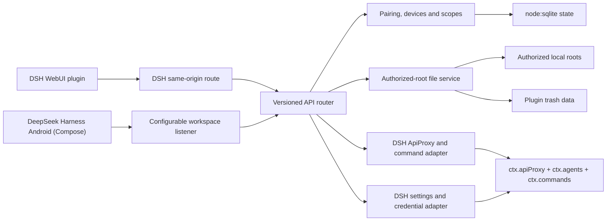

# 架构

## 组件

包同时声明 `dsh.bundle` 和 `dsh.client`。Profile patch 插入一个 Host row；DSH client module scanner 从同一包发现 `./client`，因此安装者只需执行一次 `dsh plugin add`。

Web Client 使用独立的外部语言 store 跨多个 DSH slot React 根同步界面语言，默认值为 `zh-CN`。语言按钮切换 `zh-CN`/`en` 并写入浏览器存储；slot 注册会随语言变化刷新标签，独立工作区同时更新文档标题和 `lang` 属性。

`sidebar.footer.action` 是桌面端主要入口，触发 `shell.overlay` 中的完整文件树和编辑器，不改变 DSH 页面 URL。overlay 使用 `closed/workspace/settings` 状态机；从工作区打开设置时仅隐藏而不卸载编辑器，关闭设置后保留目录、当前文件和未保存文本。`conversation.view` 保留会话内文件标签，`/dsh-workspace` 仅作为移动 WebView、直接链接和故障排查入口。

## 数据流

- 本机 DSH WebUI 通过同源嵌入 route 调用管理和文件能力；Host 使用原始 socket 地址验证回环来源。
- 外部客户端连接独立 listener。除健康检查和配对交换外，所有请求都需要设备 Bearer token。
- listener 在 SQLite 中持久化远程绑定 IP 和端口；关闭状态绑定同地址族回环，启用状态绑定配置地址。所有重绑定先保留旧 endpoint，失败时恢复旧 endpoint 后再报告错误。
- Router 先解析 principal，再检查 scope 和 root grant，最后把 `rootId + relativePath` 交给文件服务。
- 聊天 adapter 使用 DSH 注入的 `ctx.apiProxy` 处理会话、工作区、模型与消息，并用 `ctx.agents + ctx.commands` 列出/执行 host 斜杠命令；它不转发或依赖 DSH 私有 `/api` HTTP wire。冷会话通过模型查询取得 host agent 后再访问命令注册表。命令执行前仍执行 session/root 授权和当前命令列表校验，且绝不改走模型 prompt。会话创建优先使用 DSH `workspaceId`；工作区发现先读取 `workspace.list`，再按设备授权根过滤并把真实路径改写为 `rootId + relativePath`。新工作区登记先通过文件授权边界解析现有目录，再调用 `workspace.create`。Agent 模式来自 `agentPreset.list`；`agentPreset.select` 只为仍为 `blank` 的授权会话开放，宿主在执行时再次检查以避免首条消息与切换竞态。
- 审批请求由 DSH mux 的 `approval/requested` 驱动，adapter 以 `sessionId + approvalId` 缓存待处理项并把私有 `rpcId` 留在 Host 内；读取时从授权历史提取匹配工具调用，经过脱敏和长度限制后投影。设备只可提交 `allowed-once` 或 `rejected`，Host 再组装 DSH `client-response`；`approval/resolved` 或成功决定会清除缓存，mux 重连的待处理重放用于恢复状态。
- 设置 adapter 使用 DSH 稳定的 `llm.providers/models/discoverModels`、`settings.describe/mutate` 和 `credentials.describe/set/unset` 服务。读取时合并模板基值与用户覆盖，并用实时模型目录补足继承模型；自定义供应商写入 DSH 的 `llm-pi-ai/providers/<route>` 命名空间，协议选择从 DSH schema 提取。外部接口只投影可显示配置与凭据状态；API 密钥只写不读。会话模型选择继续先执行授权 session 检查。
- 文件事件和已授权的 DSH mux/host 事件经 WebSocket 广播；`assistant/chunk` 在 BFF 边界被规范化为 `chat.message.delta`，完成消息、会话状态、Agent 切换和审批变化也使用稳定事件名，移动端不解析 DSH 私有事件形状。每次广播重新读取设备状态并检查事件类别 scope 与 root/session，重连后客户端重新读取 REST 基线。

## 持久化

SQLite 保存设置、授权根、设备令牌摘要、配对、审计、回收站清单和幂等响应。文件正文和聊天正文不进入插件数据库。回收站 payload 位于插件数据目录并由清单关联。

## Android App

Android App 位于独立同级项目 `dsh-android-app`，应用名为 DeepSeek Harness，包名为 `io.github.hakunm.deepseekharness`。UI 使用 Kotlin、Jetpack Compose 与 Material 3；默认中文并可切换英文。App 的独立 `DshClient` 直接实现与 Kotlin SDK 相同的公开 `/api/v1` 契约，便于 App 仓库在 SDK 尚未发布到 Maven 时独立构建；它不导入或复刻 DSH 私有 HTTP/RPC wire。

App 的首个纵向切片是连接/配对、会话聊天和文件工作区。DSH WebUI 功能对等按 `PARITY-001` 能力矩阵推进；任何尚无稳定公开端点的功能必须先在插件增加细粒度 scope、数据脱敏、OpenAPI/AsyncAPI 和合约测试，再接入 App。
